# ECG AI Statistical Validation

*A Reproducible Deep Learning and Biostatistical Evaluation Framework for Clinical ECG Modeling*

---

## Overview

This project develops and statistically validates a deep learning model for multi-label ECG diagnostic classification using the **PTB-XL dataset** (PhysioNet, v1.0.3). It is structured to reflect medical device–grade biostatistical rigor through a Statistical Analysis Plan (SAP), clinical AI best practices, and regulatory-style validation methodology.

The project trains a 1D ResNet on 12-lead ECG signals, compares it against logistic regression and random forest baselines, and evaluates performance using bootstrap confidence intervals, DeLong tests, calibration analysis, and subgroup analysis across sex, age, and signal quality.

### Abbreviations

| Superclass | Description |
|------------|-------------|
| NORM | Normal ECG |
| MI | Myocardial Infarction |
| STTC | ST/T Change |
| CD | Conduction Disturbance | 
| HYP | Hypertrophy |

---

## Results Summary

| Model | Test Macro-AUC | Bootstrap 95% CI |
|---|---|---|
| Logistic Regression | 0.8528 | 0.8433–0.8632 |
| Random Forest | 0.8628 | 0.8535–0.8726 |
| **ResNet1D (4 blocks)** | **0.9038** | **0.8959–0.9115** |


ResNet1D significantly outperforms both baselines (DeLong test, p < 0.01). The largest per-class improvement is observed for MI (ΔAUC = +0.103 over LR, p < 0.001) and CD (ΔAUC = +0.064, p < 0.001). STTC shows no statistically significant difference across models.

### Model AUC Comparisons
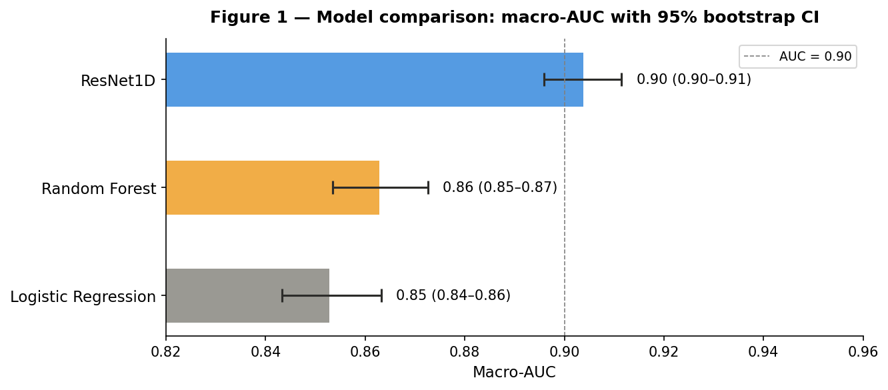
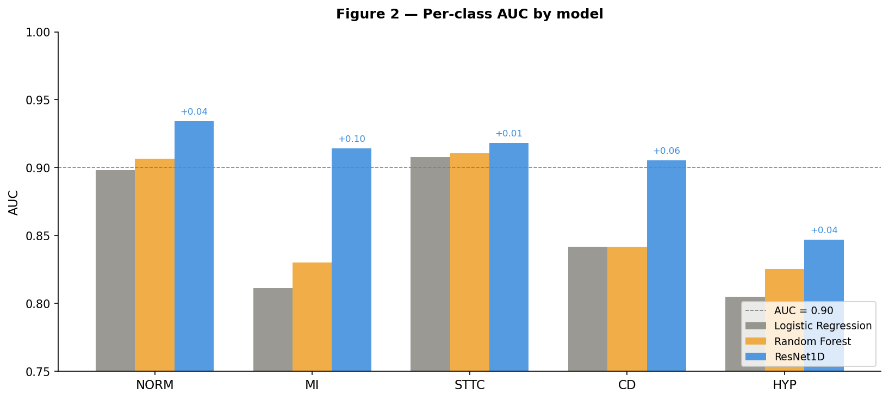

---

## Dataset

**PTB-XL** — a large publicly available electrocardiography dataset.

- 21,799 clinical 12-lead ECGs from 18,869 patients
- 10 seconds per recording at 500 Hz (100 Hz downsampled version used)
- Annotated by up to two cardiologists using SCP-ECG standard
- 5 diagnostic superclasses: NORM, MI, STTC, CD, HYP
- Recommended 10-fold stratified splits with patient-level assignment


**Citation:**
Wagner, P., Strodthoff, N., Bousseljot, R., Samek, W., & Schaeffter, T. (2022). PTB-XL, a large publicly available electrocardiography dataset (version 1.0.3). *PhysioNet*. https://doi.org/10.13026/kfzx-aw45

**Download:**
```bash
aws s3 sync --no-sign-request s3://physionet-open/ptb-xl/1.0.3/data
```

Place the downloaded data at `data/`.

---

## Project Structure

```

```

---

## Installation

**1. Clone the repository**
```bash
git clone https://github.com/cristopher-d-delgado/ecg-ai-statistical-evaluation.git
cd ecg-ai-statistical-evaluation
```

**2. Create, install and activate environment**
```bash
conda create -f environment.yaml 
conda activate ptbxl_ai
```

**3. Download PTB-XL dataset**
```bash
aws s3 sync --no-sign-request s3://physionet-open/ptb-xl/1.0.3/data
```

---

## Reproducing Results

Run the notebooks in order:

**Step 1 — EDA**
```bash
jupyter notebook notebooks/eda.ipynb
```
Covers metadata EDA, signal quality analysis, label co-occurrence, PSD analysis, and preprocessing validation. Saves `pos_weight.npy` and `test_artifact_flags.csv` to `artifacts/`.

**Step 2 — Modeling**
```bash
jupyter notebook notebooks/modeling.ipynb
```
Trains logistic regression, random forest, and ResNet1D. Runs full statistical evaluation including bootstrap CIs, DeLong test, calibration analysis, and subgroup analysis. Saves all results to `artifacts/` and figures to `figures/`.

**Step 3 — Validation report**
```bash
jupyter notebook notebooks/validation.ipynb
```
Loads saved artifacts and generates the complete statistical validation report with all publication-ready figures.

---

## Methodology

### Data splits

Author-recommended 10-fold stratified splits are used with strict patient-level assignment — no patient appears in more than one split. Folds 1–8 are used for training, fold 9 for validation, and fold 10 as the held-out test set. Folds 9 and 10 contain only human-validated labels.

```python
df['split'] = 'train'
df.loc[df['strat_fold'] == 9,  'split'] = 'val'
df.loc[df['strat_fold'] == 10, 'split'] = 'test'

```

### Preprocessing

All ECG signals undergo a two-step preprocessing pipeline:

1. Zero-phase Butterworth bandpass filter (0.5–40 Hz, order 4) — removes baseline wander and high-frequency noise while preserving all clinically meaningful ECG components. Confirmed by PSD analysis across all 12 leads.

2. Per-record z-score normalization across all leads jointly — preserves the clinically meaningful amplitude difference between limb leads (std ≈ 0.13–0.16 mV) and precordial leads (std ≈ 0.22–0.33 mV).

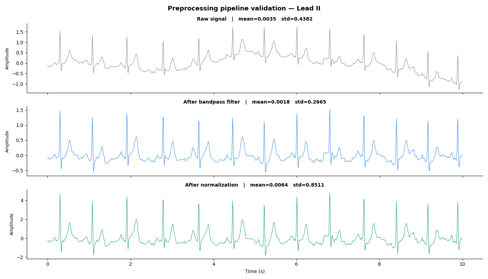

### Exploratory Data Analysis 
#### Data Quality Check
The source of this data is from a reputable source however we need to verify the ECG signals are as expected. It is never incorrect to verify data quality. 

#### Signal Quality 

**Spectral decay:** All 12 leads exhibit a consistent pattern of decreasing power with 
increasing frequency, confirming that diagnostic ECG information is concentrated in the 
lower frequency bands. No lead showed flat or increasing spectral profiles.

**Baseline wander:** Elevated power near 0 Hz was observed across all leads, consistent 
with low-frequency baseline wander caused by patient movement and respiration. This 
confirms the need for a high-pass filter cutoff at 0.5 Hz as the first preprocessing step.

**Bandpass cutoff justified:** The majority of signal power falls below the 40 Hz 
threshold across all leads, confirming that a low-pass cutoff at 40 Hz preserves all 
clinically meaningful ECG components (P wave, QRS complex, T wave) while rejecting 
high-frequency noise. No meaningful power loss is introduced by this cutoff.

**Precordial vs limb lead amplitude:** Precordial leads (V1–V6) exhibited consistently 
higher overall power than limb leads (I, II, III, aVR, aVL, aVF), consistent with the 
amplitude statistics observed in the lead statistics analysis (precordial std ≈ 0.22–0.33 
vs limb std ≈ 0.13–0.16 mV). This inter-lead amplitude difference is clinically meaningful 
and is preserved by the chosen per-record z-score normalization strategy.

**Cross-lead consistency:** All 12 leads exhibited highly similar spectral shapes, 
confirming no lead is behaving anomalously and that the data loaded correctly across 
all channels.

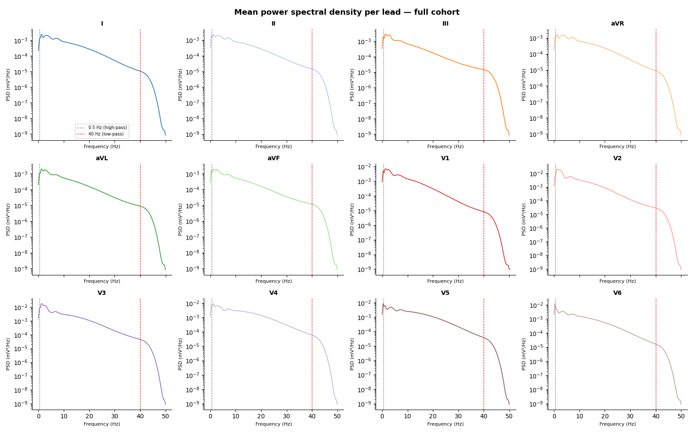

#### Demographics 
##### Global
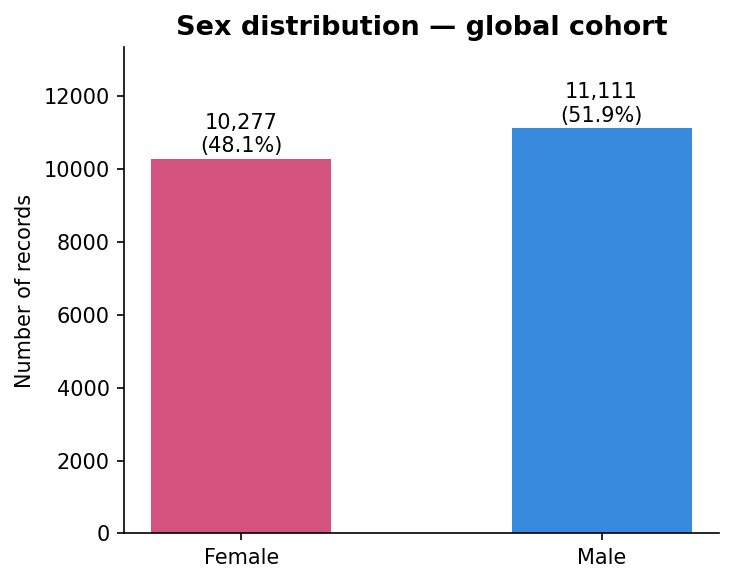
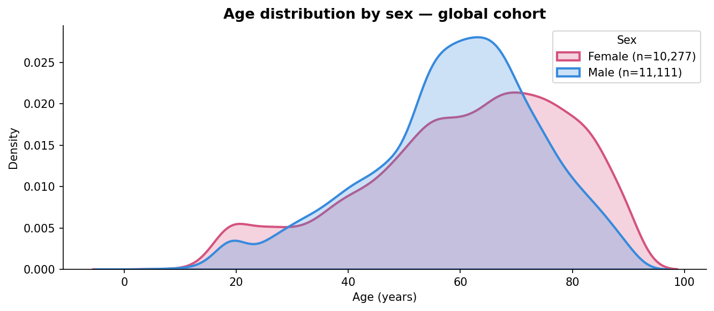


##### Training Cohort

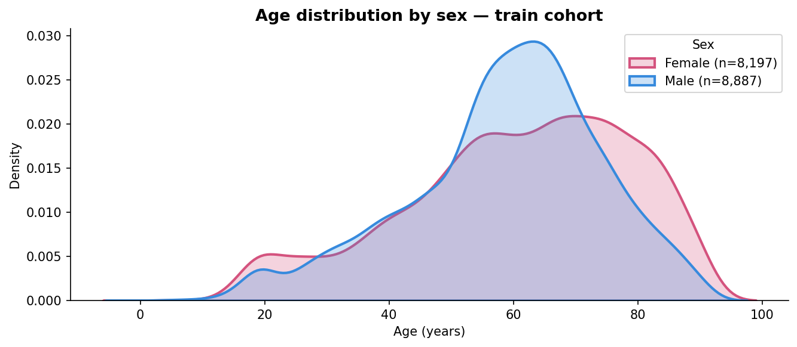
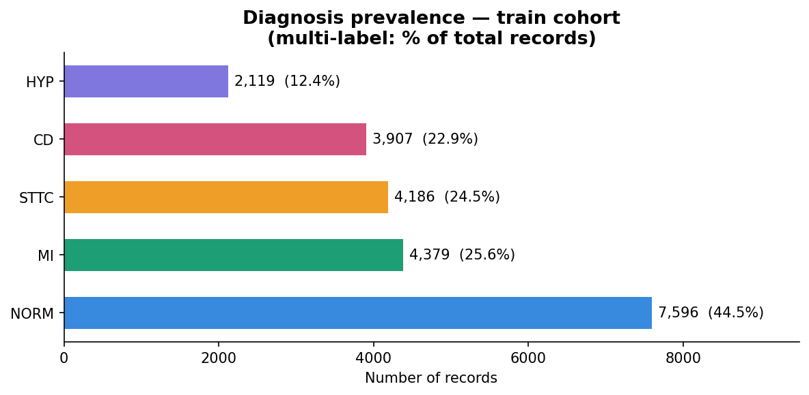

##### Test Cohort
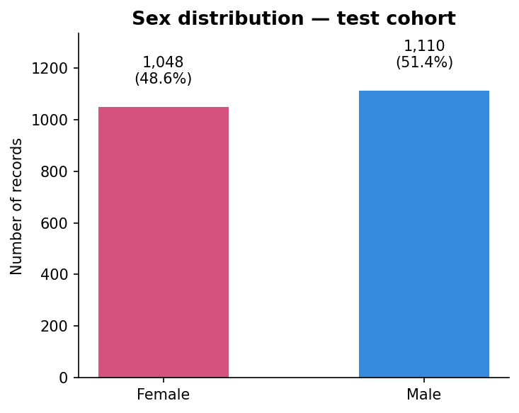
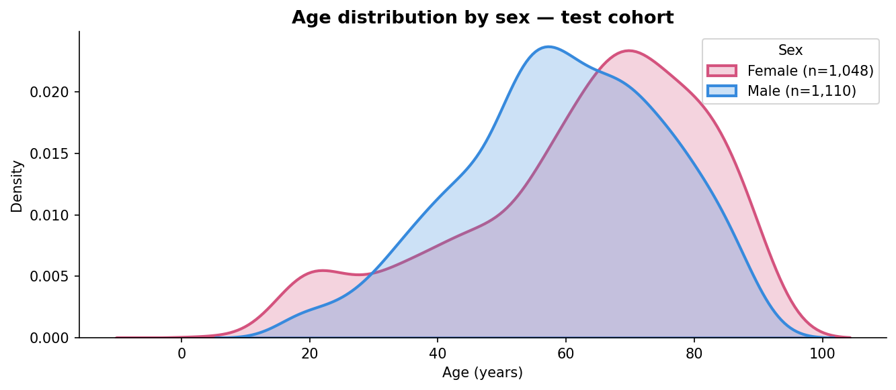
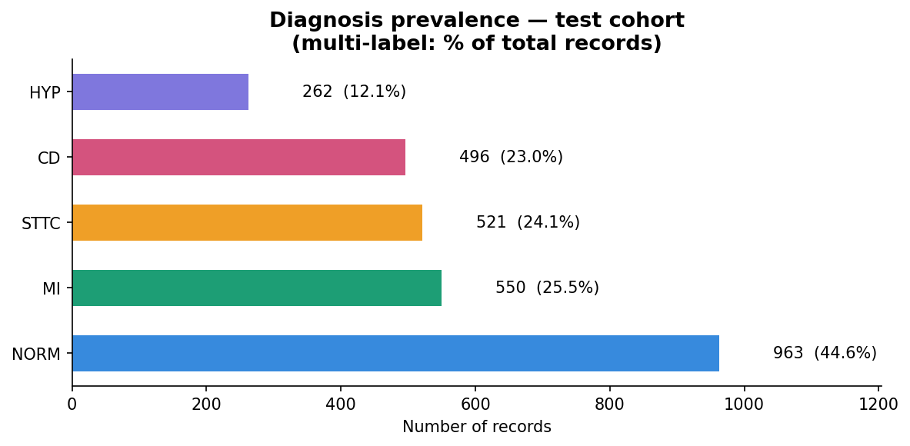

##### Validation Cohort
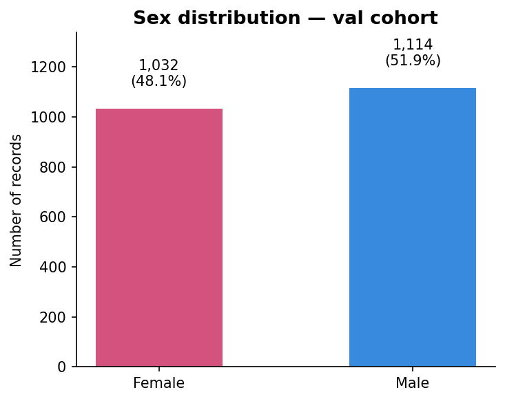
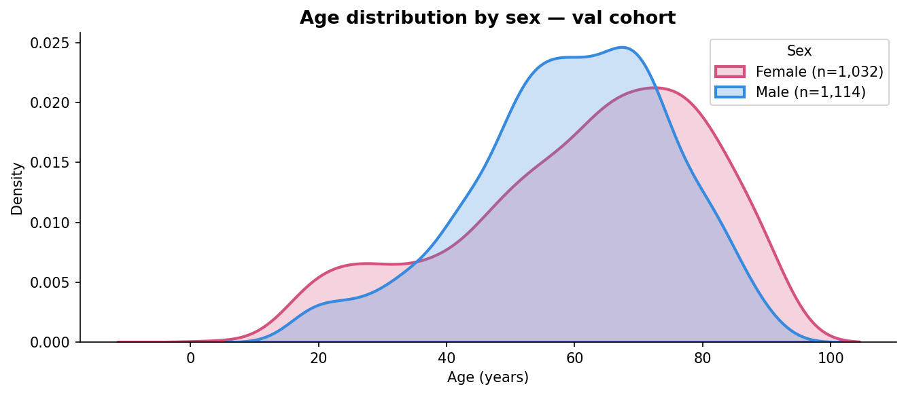
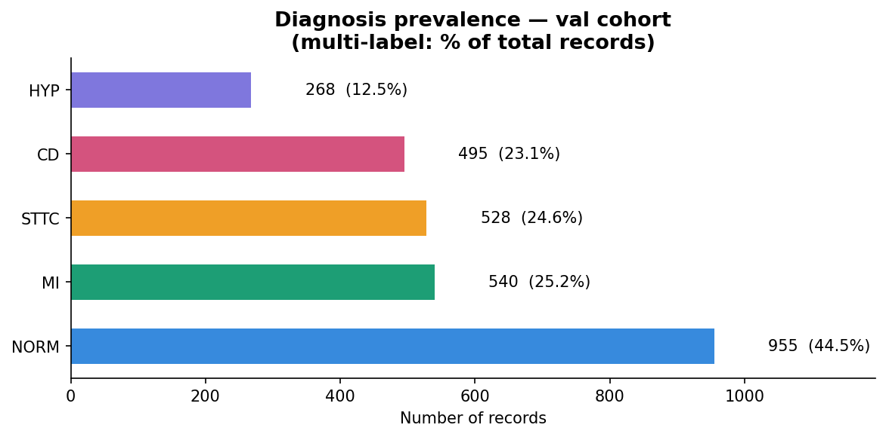

##### Decisions
1. Unbalanced dataset can create a model that would prefer to correctly diagnose one condition rather than attempting to learn the other conditions. To address this issue we can initialize the model weights to reflect the cohort distribution. Reward the model more when correctly predicting the rarer classes. 
2. Introduce Data Augmentation by taking the ECG Signals and introducing Gaussian Noise at random. This would create synthetic data creating more avaliable training samples for all classes. 

### Architecture

ResNet1D — a 1D convolutional residual network adapted from He et al. (2015) for ECG time series classification, following the benchmark architecture of Strodthoff et al. (2021).

- **Input:** (batch, 12, 1000) — 12 leads × 1000 timesteps at 100 Hz
- **Stem:** Conv1d(12→64, k=15, stride=2) + BN + ReLU + MaxPool
- **Blocks:** 4 residual blocks with progressive channel doubling (64→128→256→512)
- **Head:** Global average pooling → Dropout → Linear(512→5)
- **Output:** 5 raw logits — sigmoid applied at inference for multi-label probabilities
- **Parameters:** ~8,000,000

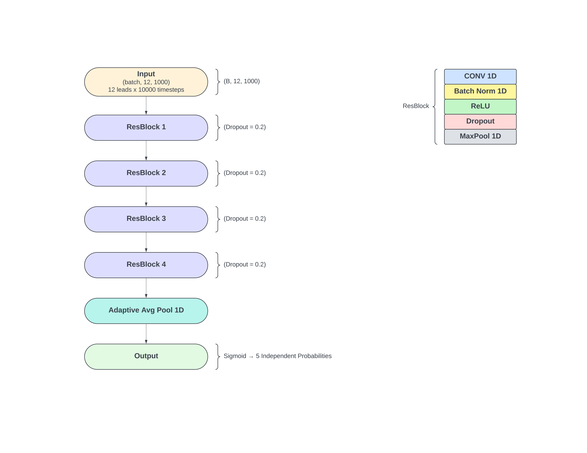

### Training

- Loss: BCEWithLogitsLoss with `pos_weight` computed from training set class frequencies
    - pos_weight was computed to accomadate the start weights as we have an imbalanced dataset
- Optimizer: Adam (lr=1e-3, weight_decay=1e-4)
- Scheduler: ReduceLROnPlateau (factor=0.5, patience=5)
- Early stopping: patience=10, monitors validation loss
- Batch size: 256
- Mixed precision: enabled (RTX 3080)
- Augmentation: Gaussian noise (p=0.5, σ=0.01) + amplitude scaling (p=0.5, ×0.9–1.1)
- Best checkpoint: epoch with lowest validation loss

### Baseline feature extraction

Logistic regression and random forest operate on 156-dimensional feature vectors extracted from preprocessed signals — 13 statistical features per lead across all 12 leads (mean, std, min, max, range, absolute mean, RMS, skewness, kurtosis, p10, p25, p75, p90). The same preprocessing pipeline is applied to ensure fair comparison.

---

## Statistical Analysis Plan (SAP)

Demonstrate how our Deep Learning model outperforms other models. 

### Primary endpoint

Macro-AUC on held-out test set with 95% bootstrap confidence interval (1000 resamples). 

### Secondary endpoints

| Metric | Method |
|---|---|
| Per-class AUC | Bootstrap CI per class |
| Sensitivity & Specificity | At class-optimal threshold (F1-maximising on val set) |
| F1 score | Per class and macro average |
| Precision-Recall AUC | Per class |
| Calibration (ECE) | 10-bin expected calibration error |
| Calibration (Brier) | Mean squared error + skill score vs naive baseline |

### Model comparison

DeLong test (Sun & Xu, 2014) comparing ResNet1D against each baseline at macro and per-class level.


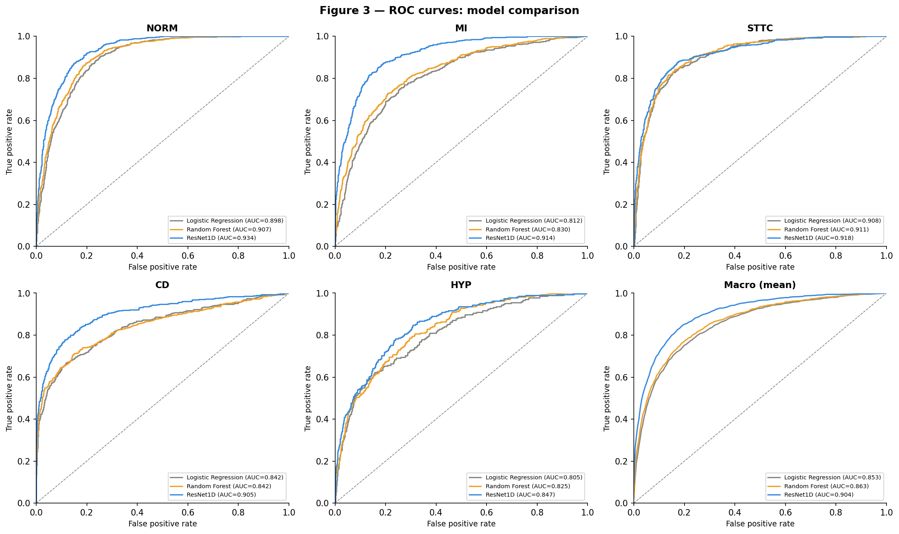

### Subgroup analyses

Performance stratified by sex, age group (<40, 40–60, 60–80, >80), and signal quality (clean vs artifact-flagged). Each subgroup reported with macro-AUC and 95% bootstrap CI.

#### ResNet 1D Model Subgroup Analysis
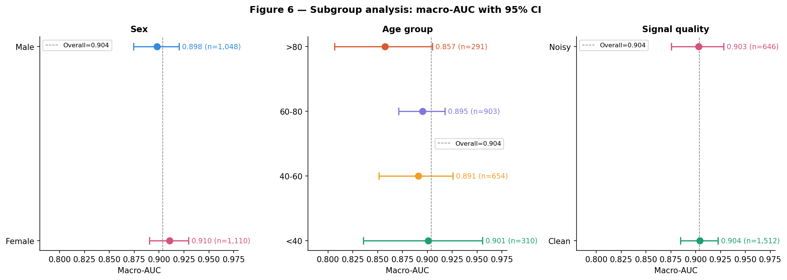

---

## Key Findings

**Per-class AUC (ResNet1D)**

| Class | AUC | 95% CI |
|---|---|---|
| NORM | 0.9340 | 0.9239–0.9438 |
| MI | 0.9142 | 0.9015–0.9264 |
| STTC | 0.9182 | 0.9059–0.9303 |
| CD | 0.9055 | 0.8878–0.9218 |
| HYP | 0.8469 | 0.8224–0.8700 |

**DeLong test — ResNet1D vs Logistic Regression**

| Class | ΔAUC | Z-stat | P-value | Significant |
|---|---|---|---|---|
| Macro | +0.051 | 3.82 | 0.000136 | Yes |
| NORM | +0.036 | 4.36 | 0.000013 | Yes |
| MI | +0.103 | 8.31 | <0.000001 | Yes |
| STTC | +0.010 | 1.07 | 0.283 | No |
| CD | +0.064 | 4.50 | 0.000007 | Yes |
| HYP | +0.042 | 2.16 | 0.031 | Yes |

**Subgroup macro-AUC**

| Subgroup | AUC |
|---|---|
| Female | 0.9105 |
| Male | 0.8979 |
| Age <40 | 0.9007 |
| Age 40–60 | 0.8909 |
| Age 60–80 | 0.8953 |
| Age >80 | 0.8574 |
| Clean signals | 0.9043 |
| Noisy signals | 0.9028 |

**Calibration**

ResNet1D macro ECE = 0.101, substantially higher than logistic regression (0.024) and random forest (0.037). Both global and per-class temperature scaling produced negligible improvement, suggesting miscalibration is driven by class imbalance rather than uniform overconfidence. Calibration is identified as a limitation requiring future work.


---

## Limitations

1. **Calibration** — ResNet1D is poorly calibrated (macro ECE = 0.101), particularly for rare classes. Temperature scaling did not resolve this. Per-class isotonic regression on a larger calibration set is recommended.

2. **Age subgroup** — The <40 age group contains very few pathological cases (MI n=7, HYP n=11). AUC estimates for this subgroup should be interpreted with caution.

3. **External validation** — All results are from PTB-XL fold 10. Generalisability to signals from different devices, institutions, or patient populations is unknown.

4. **Single dataset** — PTB-XL was collected between 1989–1996 from a single institution. Contemporary ECG devices and patient demographics may differ.

---

## References

He, K., Zhang, X., Ren, S., & Sun, J. (2015). Deep residual learning for image recognition. *arXiv*. https://arxiv.org/abs/1512.03385

Strodthoff, N., Wagner, P., Schaeffter, T., & Samek, W. (2021). Deep learning for ECG analysis: benchmarks and insights from PTB-XL. *IEEE Journal of Biomedical and Health Informatics*, 25(5), 1519–1528. https://doi.org/10.1109/JBHI.2020.3022989

Wagner, P., Strodthoff, N., Bousseljot, R., Samek, W., & Schaeffter, T. (2022). PTB-XL, a large publicly available electrocardiography dataset (version 1.0.3). *PhysioNet*. https://doi.org/10.13026/kfzx-aw45

Guo, C., Pleiss, G., Sun, Y., & Weinberger, K. Q. (2017). On calibration of modern neural networks. *ICML 2017*. https://arxiv.org/abs/1706.04599

Sun, X., & Xu, W. (2014). Fast implementation of DeLong's algorithm for comparing the areas under correlated receiver operating curves. *IEEE Signal Processing Letters*, 21(11), 1389–1393.

Chicco, D., Karaiskou, A., & De Vos, M. (2024). Ten quick tips for electrocardiogram (ECG) signal processing. *PeerJ Computer Science*, 10, e2295. https://doi.org/10.7717/peerj-cs.2295

---

## Citation

If you use this code or methodology, please cite:

```bibtex
@misc{delgado2026ecgai,
  author = {Delgado, Cristopher},
  title  = {ECG AI Statistical Validation},
  year   = {2026},
  url    = {https://github.com/cristopher-d-delgado/ecg-ai-statistical-evaluation}
}
```